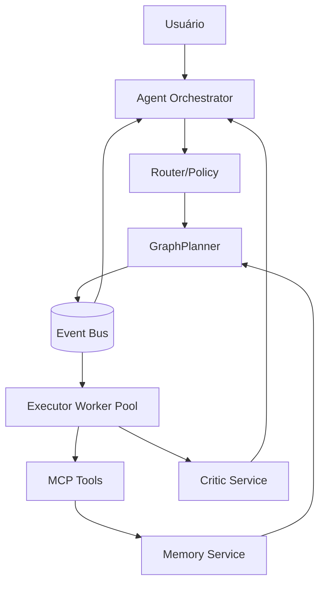
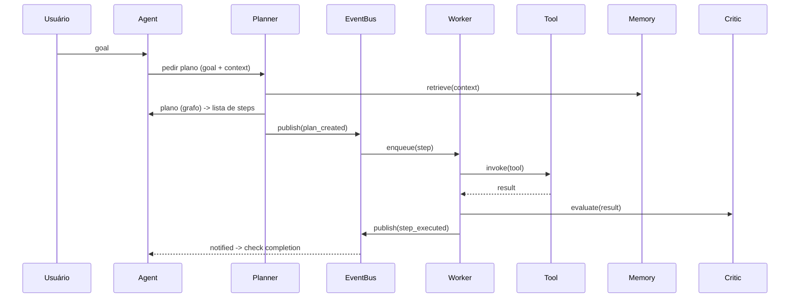

# RFC: Arquitetura do Engine — LangGraph, OpenAI Agents SDK, MCP e EDA

Data: 2026-06-04

Status: Draft

Resumo
------
Este RFC descreve a proposta de migrar o engine atual para uma arquitetura baseada em:

- LangGraph (representação de plano como grafo)
- OpenAI Agents SDK (orquestração de agentes/LLM calls)
- MCP (Model/Tool Contract Pattern) para catalogar ferramentas
- EDA (Event Driven Architecture) para comunicação assíncrona e observabilidade

Objetivos
---------

- Desacoplar componentes (planner, executor, memory, critic)
- Garantir isolamento e sandboxing para execução de ferramentas críticas
- Fornecer observabilidade e durabilidade via eventos
- Facilitar troca de LLMs e adoção incremental

Componentes principais (visão rápida)
------------------------------------

- Planner (GraphPlanner): gera um grafo de intenções e dependências; valida contra catálogo MCP.
- Agent Orchestrator: gerencia diálogo, fallback e chamadas LLM com budget/token enforcement.
- Tool Manager (MCP Adapter): catálogo de ferramentas com schema e endpoints padronizados.
- Executor Workers: workers assíncronos que consomem tarefas e executam ferramentas em sandbox.
- Memory Service: API dedicada para ingest/retrieve/summarize com vector DB.
- Critic Service: avaliador desacoplado que pode usar regras + modelo de avaliação.
- Event Bus (Async + Broker): pub/sub assíncrono (Redis/Kafka) para eventos e telemetria.

Diagrama de alto nível
----------------------

Fluxo básico (sequência)
------------------------

Mapa de dependências e chamadas LLM / token
------------------------------------------

- Agent Orchestrator: faz chamadas LLM para conversação/planning; aplica token budget por sessão/task (integra com StateManager).
- Planner (quando usa LLM): pode gerar estrutura (langgraph schema) e retorna nodes; recomenda-se usar batching e cache.
- Memory Service: chamada por Planner/Agent para recuperação; deve retornar resumo truncado (max tokens) e score para ranking.
- Cada chamada ao LLM deve registrar consumo de tokens em `StateManager.consume_tokens`.

Gargalos atuais mapeados para mitigar
------------------------------------

- LLM síncrono bloqueante: migrar para chamadas assíncronas/filas + retries controlados.
- Executor faz operações pesadas (pytest) inline: extrair para worker/container isolado.
- EventBus síncrono: trocar por broker (Redis/Kafka) ou AsyncEventBus para evitar blocking.
- Memory local sem summarizer: inserir summarizer/trim antes de enviar contexto ao LLM.

Protótipos adicionados no repositório
-------------------------------------

- [service/eventbus/async_event_bus.py](service/eventbus/async_event_bus.py) — EventBus assíncrono + adapter de compatibilidade
- [service/eventbus/redis_adapter.py](service/eventbus/redis_adapter.py) — esboço de adapter Redis
- [service/tools/mcp_adapter.py](service/tools/mcp_adapter.py) — catálogo e MCPTool protótipo
- [service/executor/worker.py](service/executor/worker.py) — ExecutorWorker assíncrono protótipo
- [service/planner/graph_planner.py](service/planner/graph_planner.py) — GraphPlanner (esboço)
- [service/memory/service.py](service/memory/service.py) — Serviço de memória (FastAPI blueprint)
- [service/critic/evaluator.py](service/critic/evaluator.py) — Critic service protótipo

Plano incremental de migração (fases e estimativas)
--------------------------------------------------

Estimativas em pessoa-dias (PD). Valores aproximados e dependem da equipe.

Fase 1 — Infra mínima e EventBus async (2–3 PD)
- Adicionar `AsyncEventBus` e adapter de compatibilidade, adaptar observers.

Fase 2 — MCP ToolCatalog & Executor Worker (4–6 PD)
- Implementar `ToolCatalog`, tornar `actions/registry.py` adapter para MCP, criar `ExecutorWorker` e fila.

Fase 3 — Memory Service (4–6 PD)
- Extrair memória para microserviço, adicionar summarizer, integração com vector DB (FAISS/Pinecone).

Fase 4 — GraphPlanner + OpenAI Agents SDK (6–10 PD)
- Substituir planner por GraphPlanner; integrar LangGraph/Agents SDK; testes de produção.

Fase 5 — Critic Service e políticas (2–3 PD)
- Tornar critic um serviço, treinar/afinar heurísticas.

Fase 6 — Hardening, integração e testes (5–8 PD)
- Integração com CI, sandboxing (containers), observabilidade (metrics/tracing), testes de regressão.

Estimativa total: 23–36 PD (timebox e iterações curtas recomendadas).

Observações operacionais
-----------------------

- Priorizar POCs e integrações não intrusivas (adapters e feature flags).
- Garantir que _apply_patch_flow_ continue a correr em ambiente isolado (container) antes de mover para worker.
- Definir contratos MCP para cada ferramenta crítica (I/O schema).

Próximos passos sugeridos
------------------------

1. Revisar protótipos adicionados em `service/` e rodar POC local (EventBus + Worker)
2. Definir schemas MCP para as ferramentas críticas (write_file, run_python, apply_patch)
3. Implementar Memory Service com backend vetorial e summarizer
4. Migrar planner em modo paralelo e testar com rota de feature-flag

---

Autor: (proposta automatizada) — adaptar estilo e detalhes conforme time.
